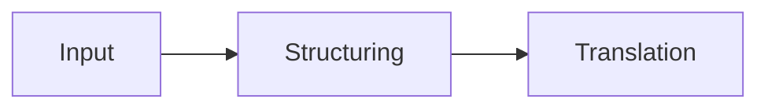

# Heading 1: the look sample

## Heading 2

### Heading 3

#### Heading 4

##### Heading 5

###### Heading 6

A paragraph with *italic*, **bold**, ***bold italic***, ~~strikethrough~~ and `inline code`, then <kbd>Ctrl</kbd>+<kbd>C</kbd>, H<sub>2</sub>O, x<sup>2</sup> and <mark>highlighted</mark> text. A footnote follows this sentence.[^1]

Links in every form: an [inline link](https://example.com/inline), one [with a title](https://example.com/titled "The link's title"), a [reference link][ref], a [collapsed reference][], an autolink <https://example.com/autolink>, a bare URL https://example.com/bare, and an email <someone@example.com>.

A long URL that has to wrap: https://example.com/a/very/long/path/that/keeps/going/and/going/until/it/cannot/fit/on/one/line/of/a/narrow/pin/window?query=string&with=many&parameters=attached#and-a-fragment

A long word that has to break: Donaudampfschifffahrtselektrizitätenhauptbetriebswerkbauunterbeamtengesellschaft.

[ref]: https://example.com/reference
[collapsed reference]: https://example.com/collapsed

## Lists

- An unordered item
- An item with a nested list:
  - A nested item
  - Another nested item
    - A third level
- An item with an ordered list inside:
  1. First
  2. Second

1. An ordered item
2. An ordered item with a nested list:
   1. Nested first
   2. Nested second
3. A third ordered item

A list that starts at five:

5. Five
6. Six

A task list:

- [x] A done task
- [ ] An open task
  - [x] A nested done task
  - [ ] A nested open task

## Quotes

> A quote in the secondary colour.
>
> > A nested quote inside it.
> >
> > > And a third level.

## Code

```ts
// A labelled code block.
export function greet(name: string): string {
  return `Hello, ${name}!`;
}
```

```
An unlabelled code block.
It has no language.
```

```json
{ "aVeryLongLine": "that is much wider than any pin window, so the code block has to scroll sideways inside itself rather than widen the window", "n": 1 }
```

```python
# A tall code block, past the 400 px maximum height.
line_01 = 1
line_02 = 2
line_03 = 3
line_04 = 4
line_05 = 5
line_06 = 6
line_07 = 7
line_08 = 8
line_09 = 9
line_10 = 10
line_11 = 11
line_12 = 12
line_13 = 13
line_14 = 14
line_15 = 15
line_16 = 16
line_17 = 17
line_18 = 18
line_19 = 19
line_20 = 20
line_21 = 21
line_22 = 22
line_23 = 23
line_24 = 24
line_25 = 25
line_26 = 26
line_27 = 27
line_28 = 28
line_29 = 29
line_30 = 30
```



## Tables

| Left aligned | Centred | Right aligned |
| :--- | :---: | ---: |
| apple | 1 | 0.50 |
| banana | 22 | 12.25 |
| cherry | 333 | 1,234.00 |

| Column one | Column two | Column three | Column four | Column five | Column six | Column seven | Column eight |
| --- | --- | --- | --- | --- | --- | --- | --- |
| a wide table | that has more columns | than a narrow window | can show at once | so it scrolls | sideways inside | itself rather | than widen it |
| second row | with `code` | and **bold** | and a [link](https://example.com/table) | more | cells | to | fill |

---

<details>
<summary>A details element</summary>

Text that shows once the details element is opened.

</details>


[^1]: The footnote's text, shown small after a divider.
